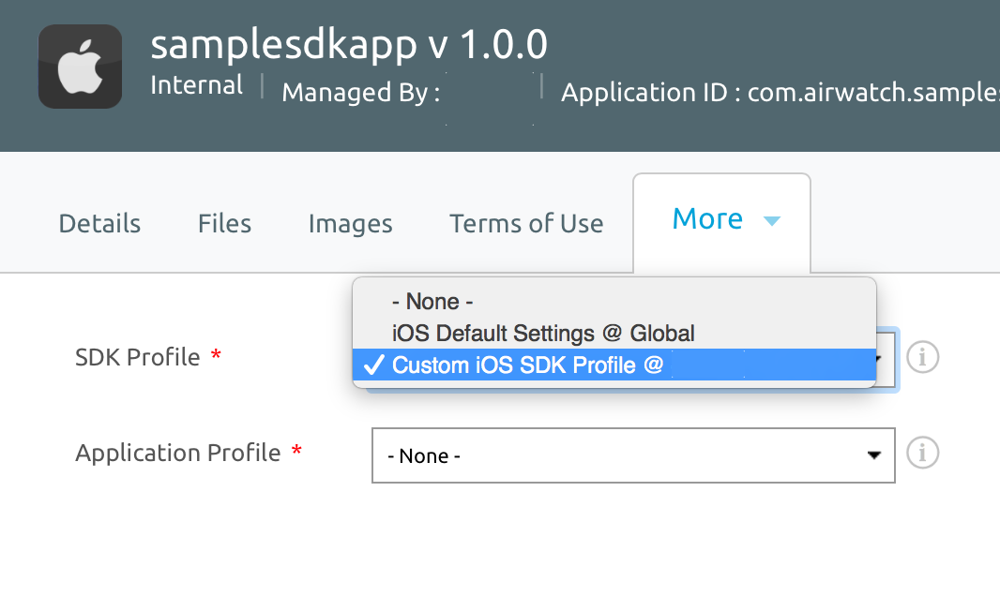
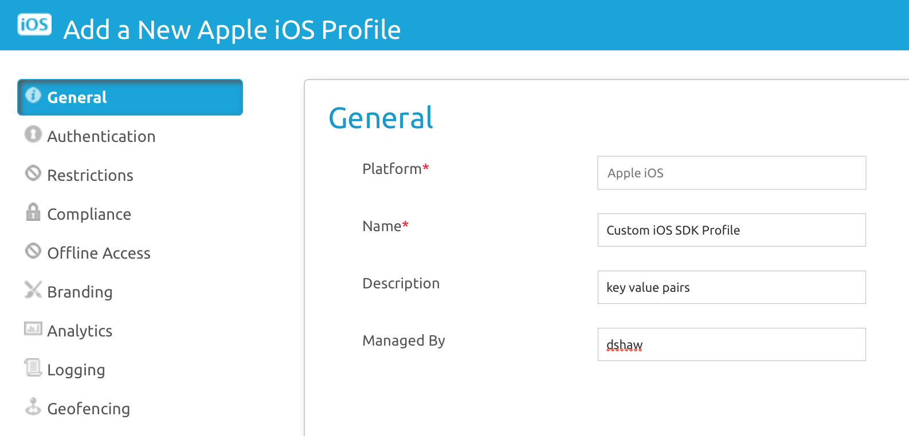
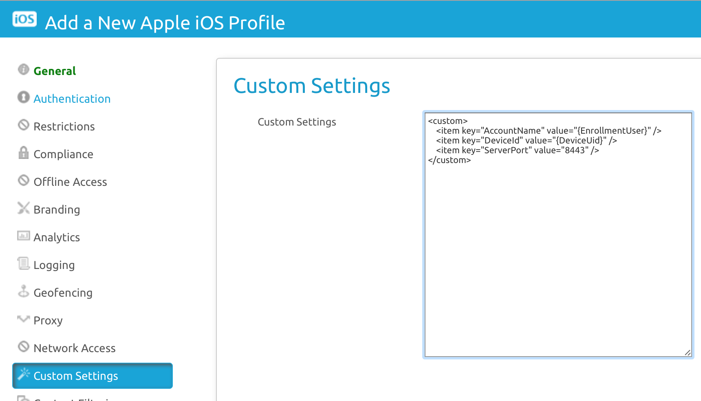

## Overview

The steps in this tutorial are done with the assumption that you have gone through the steps in [Getting Started](../getting-started.md) tutorial as well as the SDK Setup section.

!!!Important
    You will need to download the SDK binary separately via [resources.resources.com](https://resources.workspaceone.com). Please contact your AirWatch representative or support to gain access.

## Requirements

- iOS 7+
- Xcode
- iOS Test Device
- AirWatch SDK from AirWatch Resource Portal

## Tutorial

### Step 1: Integrate the AirWatch SDK

Follow the instructions in the [Getting Started](../getting-started.md) tutorial to integrate the AirWatch Software Development Kit (SDK) for iOS into your application.

### Step 2: Add Custom Settings in your SDK profile

For this next part, you will need to check which profile you have assigned to your SDK app. You can do this by navigating to Apps & Books > Details View. Click Edit. Choose More > SDK. Check what profile is assigned for SDK Profile.
   

### Using the Default SDK Profile (Recommended)

1. If the profile assigned is the default profile, then the policy settings can be edited by navigating to Apps & Books > All Apps & Books Settings > Apps > Settings And Policies > Settings.
2. Enable the custom settings and add your custom settings. This is a string field and can contain XML, JSON, or plain text. You can also insert lookup values if desired.
   
3. Once you are done, click save to start enforcing the new policy.

### Using a custom profile

1. In the AirWatch Console, Choose Apps & Books > All Apps & Books Settings.
2. Choose Settings and Policies > Profiles and click Add Profile to create a custom profile or edit an already existing profile currently assigned to your app.
   
3. You will be asked to Choose SDK Profile or Application Profile. Select the SDK profile.
4. Choose iOS and fill in the Name field on the General Tab.
   
5. Click Custom Settings on the left, and add your custom settings. This is a string field and can contain XML, JSON, or plain text. You can also insert lookup values if desired.
   
6. Save the Profile.

### Step 3: Retrieving the Profile within Your Application

The code to retrieve these settings within the app is very simple if SDK integration is already done from Step 1:

```C
- (void) receivedProfiles: (NSArray *) profiles {
NSLog(@"Profiles received");

AWCustomPayload *custom = [[profiles firstObject] customPayload];
NSString *customSettings = custom.settings;
...
}
```

Here is a screenshot from the debugger showing the sample XML settings entered in the AirWatch Console above:


Use these settings however you wish in your app!
